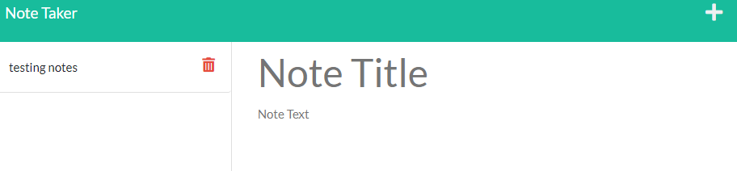

# express-note-taker

## Description: 
This project allows the user to keep track of their notes.

## Usage: 
To use this project, the user must first input a "note title" followed by the actual notes. 
If the user wants the save their notes, the user must press the save button that only appears after the first step is completed.
If the user would like to add a new note page, then the user must press the plus button. 
If the user would like to delete notes, then the user must press the red trash icon. 

## Deployed Application: 

Deployed Application: https://express-note-taker-jk.herokuapp.com/notes